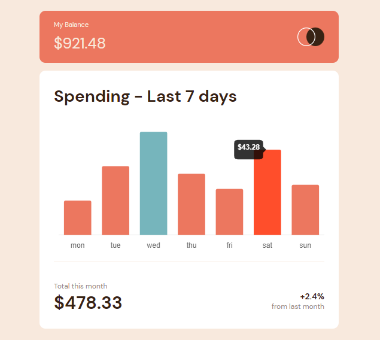

# Frontend Mentor - Expenses chart component solution

This is a solution to the [Expenses chart component challenge on Frontend Mentor](https://www.frontendmentor.io/challenges/expenses-chart-component-e7yJBUdjwt). Frontend Mentor challenges help you improve your coding skills by building realistic projects. 

## Table of contents

- [Overview](#overview)
  - [The challenge](#the-challenge)
  - [Screenshot](#screenshot)
  - [Links](#links)
- [My process](#my-process)
  - [Built with](#built-with)
  - [What I learned](#what-i-learned)
  - [Continued development](#continued-development)
  - [Useful resources](#useful-resources)
- [Author](#author)


## Overview

### The challenge

Users should be able to:

- View the bar chart and hover over the individual bars to see the correct amounts for each day
- See the current day’s bar highlighted in a different colour to the other bars
- View the optimal layout for the content depending on their device’s screen size
- See hover states for all interactive elements on the page
- **Bonus**: Use the JSON data file provided to dynamically size the bars on the chart

### Screenshot



### Links

- Solution URL: [Github](https://github.com/Emmanuel-obiora/expense-chart)
- Live Site URL: [gh-pages](https://emmanuel-obiora.github.io/expense-chart)

## My process

### Built with

- Semantic HTML5 markup
- CSS custom properties
- Flexbox
- CSS Grid
- [React](https://reactjs.org/) - JS library
- SASS - For styles

### What I learned

I learnt how to create chart using chart.js and react-chartjs-2 re-usable component.

To see how you can add code snippets, see below:

```js
const options = {
    responsive: true,
    plugins: {
      legend: {
        display: false,
      },
      title: {
        display: false,
        text: 'Expense Chart',
      },
      tooltip: {
        // enabled: false,
        callbacks:
        {
          title: (context) =>
          {
            // console.log(`$${context[0].parsed.y}`);
            return (`$${context[0].parsed.y}`);
          },
          label: (context) => {
            // console.log(context.label);
            return ''
          },
        }
      },
    },
    scales: {
      x: {
        grid: {
          display: false
        }
      },
      y: {
        grid: {
          display: false,
        },
        ticks: {
          display: false,
        },
        border: {
          display:false
        }
      }
    },
  };
```


### Continued development

To continue workinh wiyh react component, and improve more on the usage of chart.js 

### Useful resources

- [Chart.js documentation](https://www.chartjs.org/docs/latest/general) - This helped me in understanding the chart.js built-in props for eacy data manipulation.

## Author

- Website - [Add your name here](https://www.your-site.com)
- Frontend Mentor - [@yourusername](https://www.frontendmentor.io/profile/yourusername)
- Twitter - [@yourusername](https://www.twitter.com/yourusername)
